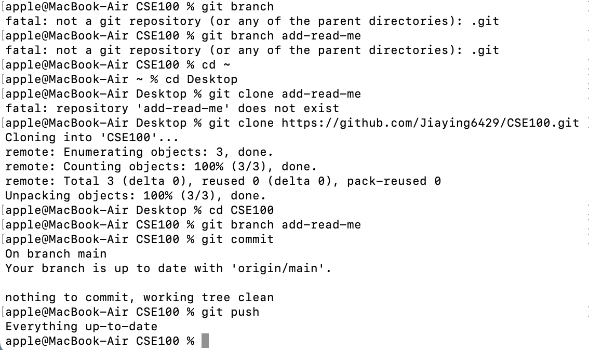
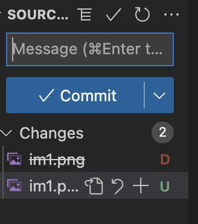

# Heading 1
## Heading 2
### Heading 3

**bold**

_Italian_

~~remove~~

**combined bold and _italian_**

***both***

<sub> subscript </sub>

<sup> superscript </sup>

> Quote


`git`


```block```

[link](ucsd.edu) 

[relative link](docs/README.md)

[section link](#heading-1)

- List1
- List2

1. List 1
2. List 2

3. List1
   - sublist 1
     - sublist2


- [ ] lab1
- [x] hw0